  

### Hi there, I'm **Raghav** ✨

> **"Systems program with precision; design with empathy."** 💖

I build *fast, reliable systems* under the hood and *clean, friendly interfaces* on the surface — a bit of an engineer, a bit of a designer. 

---

**⚙️ What I build** ✨

- 🧠 **CppLab** - React and Node.js
- 🚦 **ApolloGateway** — C++20 L7 proxy · `epoll` · 20k sockets/thread
- 🌐 **Android-TODO-App** - Dart, Flutter, RiverPod, Hive.
- 🔐 **CryptX** — E2E encrypted messenger · React + Flask · 95+ Lighthouse

**🧰 My toolbox** ⭐

`C++20` · `Java` · `JavaScript` · `Python` · `Dart` · `SQL`
`React` · `Tailwind` · `WebGL` · `Flutter` · `REST`
`Docker` · `Linux` · `Redis` · `epoll` · `Raft`

**🌱 Right now**

B.Tech CSE '27 · 450+ LeetCode · dreaming in pixels 💜 💖 ✨

---

📬 [LinkedIn](https://www.linkedin.com/in/raghav-verma7/) · [GitHub](https://github.com/RaghavVerma99) · [LeetCode](https://leetcode.com/u/risshu_raghav/) · [Email](mailto:risshu.verma7@gmail.com)

*Made with 💙 and slightly too much coffee.* ✨ 💖 ⭐
